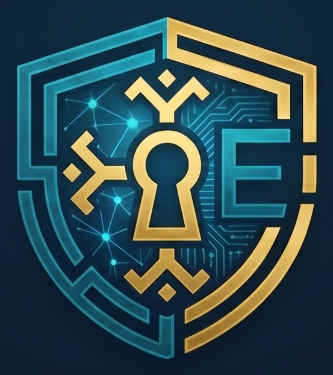

<p align="center">
  
</p>

<h1 align="center">Ellkan</h1>
<p align="center">Zero-knowledge, self-hosted password manager.</p>
<p align="center"><a href="README.md">Español</a> · <b>English</b> (this file)</p>

**Ellkan** — from Mapudungun *elkan*, "to hide, to conceal."

## What Ellkan is

A self-hosted password manager with a zero-knowledge architecture: the server never sees your private keys or your secrets in plaintext. Backend in Rust (Axum), encryption with modern primitives (X25519, Ed25519, XChaCha20-Poly1305, Argon2id), web frontend and browser extension share the same cryptographic core compiled to WebAssembly.

## Tech stack

### Backend

| Component | Technology |
| --- | --- |
| Language | Rust (2024 edition) |
| Web framework | Axum (on Tokio) |
| Database | PostgreSQL 18+ |
| Data access | `sqlx`, compile-time verified queries |
| Authentication | Ed25519 nonce-signature — no passwords stored server-side |
| Architecture | Modular monolith (Controller → Service → Repository) |
| Deployment | Docker / Docker Compose |

### Frontend and extension

| Component | Technology |
| --- | --- |
| Web frontend | SvelteKit + TypeScript |
| Browser extension | Manifest V3 (Chrome, Firefox, Safari) |
| Cryptographic core | Compiled to WebAssembly, shared across backend, web, and extension |
| Package manager | pnpm |
| E2E testing | Playwright |

### Cryptography

| Primitive | Use |
| --- | --- |
| X25519 | Key agreement (end-to-end encryption) |
| Ed25519 | Digital signatures (authentication) |
| XChaCha20-Poly1305 | Authenticated encryption (AEAD) of secrets and metadata |
| Argon2id | Master key derivation from the passphrase |
| HKDF-SHA256 | Domain-separated subkey derivation per context |
| zeroize / secrecy | Secure wiping and redaction of secrets in memory |
| subtle | Constant-time comparisons (timing-attack mitigation) |

## Quickstart

Requires Docker and Docker Compose.

```bash
git clone https://github.com/athomo001/Ellkan.git
cd Ellkan
cp .env.example .env
set -a && source .env && set +a

# Deployment secrets — see secrets/README.md for details on each one.
# Reads POSTGRES_USER/POSTGRES_DB from the .env you just loaded — if you
# changed them above, this builds the right DATABASE_URL on its own,
# instead of you having to keep two places in sync by hand.
openssl rand -hex 24 > secrets/postgres_password.txt
openssl rand -base64 32 > secrets/ellkan_secrets_key.txt
echo "postgres://${POSTGRES_USER:-ellkan}:$(cat secrets/postgres_password.txt)@ellkan-db:5432/${POSTGRES_DB:-ellkan}" > secrets/database_url.txt

docker compose up -d
```

The app is now at `http://localhost:${ELLKAN_PORT:-8080}`. The first admin is created via the CLI (no pre-built binaries yet — build it from source):

```bash
cargo build --release -p ellkan-cli

# DATABASE_URL here is DIFFERENT from the one in secrets/database_url.txt:
# that one uses Docker's internal hostname (ellkan-db), which only
# resolves inside the container network — this one points at the port
# docker-compose exposes on 127.0.0.1 so the CLI (running on the host)
# can reach it.
DATABASE_URL="postgres://${POSTGRES_USER:-ellkan}:$(cat secrets/postgres_password.txt)@localhost:${POSTGRES_PORT:-5433}/${POSTGRES_DB:-ellkan}" \
  ./target/release/ellkan-cli admin create-user \
  --email you@example.com --display-name "Your name" --role admin

./target/release/ellkan-cli --server-url "http://localhost:${ELLKAN_PORT:-8080}" login --email you@example.com
```

`--role admin` promotes directly (over SQL, never through HTTP — no HTTP route lets an account self-assign admin) and marks this device as known, so the `login` above works right away without waiting on any email — no SMTP needed to get started. Once inside, configure a real relay at `/admin/smtp` so device verification for any other login/user arrives by email for real.

See [manual/cli.md](manual/cli.md#comandos) for the rest of the commands.

## Documentation

Detailed manuals are currently Spanish-only:

- [manual/funcionalidades.md](manual/funcionalidades.md) — what Ellkan does, by area.
- [manual/cli.md](manual/cli.md) — full `ellkan-cli` reference.

## FAQ

**Can the server see my passwords?**
No. Everything is encrypted and decrypted on your own device, never on the server — it's like handing someone a locked safe to hold onto: they can store it, but they never get a key to open it or see what's inside.

**What happens if someone steals the server's database?**
They don't get your passwords — they only get locked safes. Without your master password (which is never stored anywhere, not even on the server), there's no way to open them.

**How do you protect my keys in the computer's memory (RAM) while they're being used?**
The key is never left sitting around in memory waiting for someone to grab it. Every time it's needed, it's rebuilt on the spot from your password, used for an instant, and immediately wiped — like writing something on a piece of paper, using it once, and tearing it up right away, instead of leaving it lying on the desk. Your master password is kept only while your session is open and never touches the disk: close the browser or app, and it's gone. The one thing this can't prevent: if your computer already has malware spying on it, that malware could see the key at the exact instant you're using it — no password manager can protect you from that, because at that point the attacker is already inside your machine, not inside the system.

## Status

Actively in development. Backend and web frontend work end to end (registration, login, vault, groups, MFA, SSO/SCIM/LDAP, auditing, admin panel, export/backup) — the browser extension hasn't started yet.

## License

**AGPL-3.0** — see [LICENSE](LICENSE) (official English text, the only legally binding one) and [LICENSE.es.txt](LICENSE.es.txt) (unofficial Spanish translation, for reference only).
