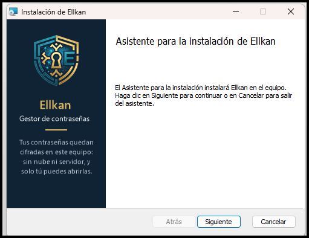
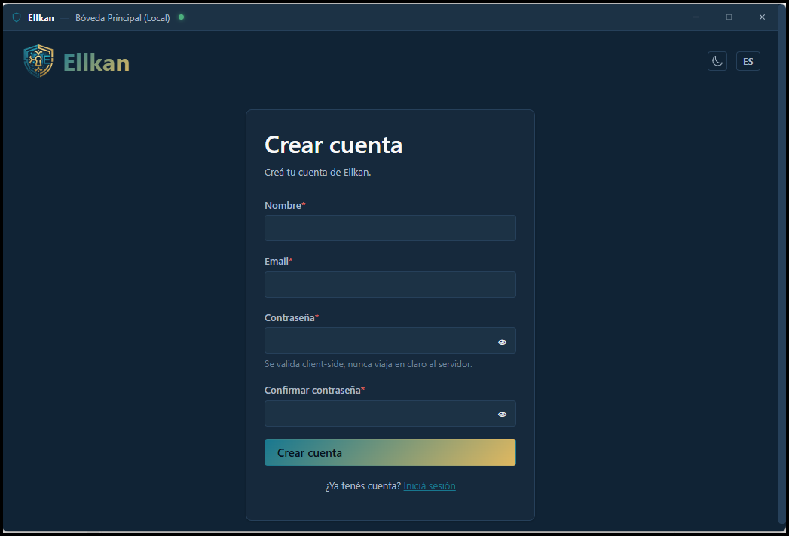
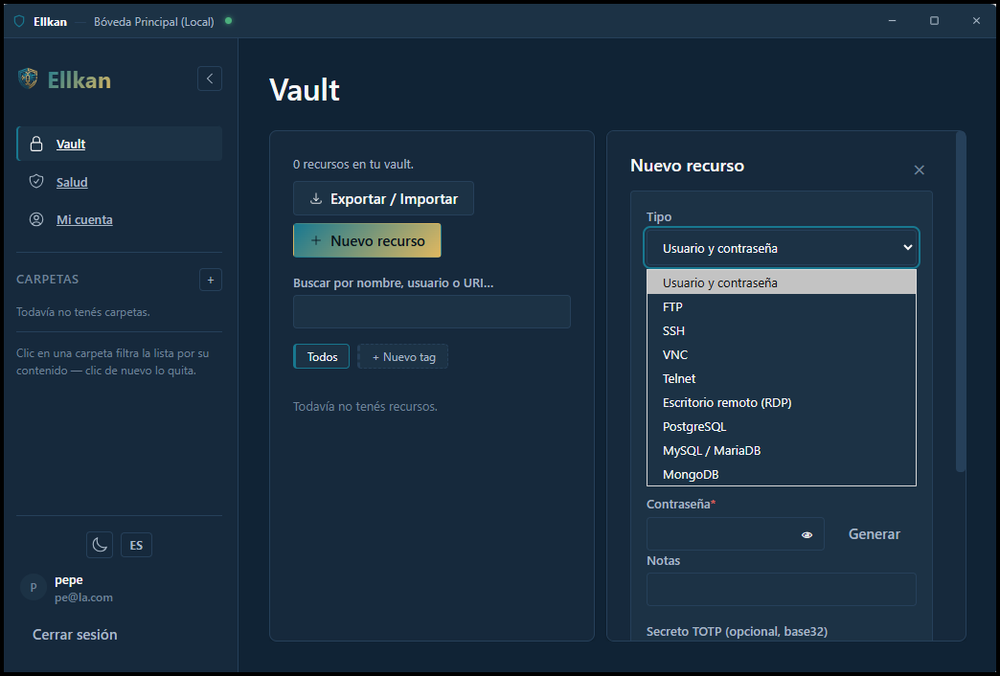
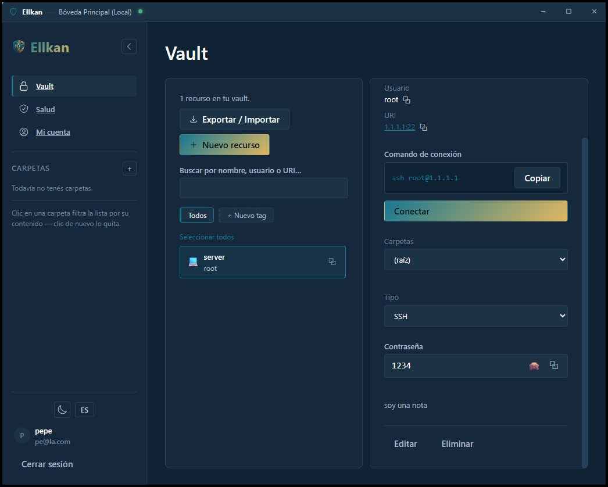

# Ellkan de escritorio — guía

Ellkan de escritorio es un gestor de contraseñas para **una sola persona**, que guarda todo cifrado en tu propio equipo y funciona sin conexión ni servidor. Opcionalmente puede conectarse a un servidor Ellkan para respaldar y sincronizar (sección 7).

Está en **beta** y sólo corre en **Windows 10/11 de 64 bits**. Linux y macOS todavía no.

## Contenido

1. [Empezar](#1-empezar)
2. [Uso diario](#2-uso-diario)
3. [Tipos de recurso y «Conectar»](#3-tipos-de-recurso-y-conectar)
4. [Salud de la bóveda](#4-salud-de-la-bóveda)
5. [Extensión de navegador](#5-extensión-de-navegador)
6. [Tus datos, copias y recuperación](#6-tus-datos-copias-y-recuperación)
7. [Conectar a un servidor](#7-conectar-a-un-servidor)
8. [Opciones del sistema](#8-opciones-del-sistema)
9. [Seguridad: qué protege y qué no](#9-seguridad-qué-protege-y-qué-no)
10. [Problemas frecuentes](#10-problemas-frecuentes)
11. [Para quien compila y prueba](#11-para-quien-compila-y-prueba)
12. [Lo que todavía no existe](#12-lo-que-todavía-no-existe)

---

## 1. Empezar

### Requisitos e instalación

- **WebView2.** Viene con Windows 11 y, normalmente, con Windows 10 actualizado. Si falta, instálalo desde Microsoft.
- **Con instalador (recomendado).** Ejecuta `Ellkan_<versión>_x64_es-ES.msi`. Pide permisos de administrador porque se instala en `C:\Program Files\Ellkan`, y crea un acceso en el menú Inicio y otro en el escritorio. Si tu equipo no tiene WebView2, el instalador lo descarga (necesita internet).
- **Sin instalador.** Copia `ellkan-desktop.exe` y `ellkan_askpass.exe` a una carpeta (los dos juntos: el segundo lo usa «Conectar» por SSH) y ejecuta el primero. Para llevarla en un pendrive, ver *Modo portable* en la [sección 8](#8-opciones-del-sistema).
- **Ni el instalador ni el ejecutable están firmados.** La primera vez SmartScreen puede advertirlo: «Más información» → «Ejecutar de todos modos».



### Actualizar y desinstalar

- **Actualizar:** ejecuta el MSI de una versión más nueva sobre la instalada. Cierra Ellkan si estaba abierto (la bóveda no se pierde) y conserva tus datos y tus opciones, incluidos el inicio con Windows y los enlaces `ellkan://`.
- **Desinstalar:** *Configuración → Aplicaciones → Ellkan → Desinstalar*, o *menú Inicio → Ellkan → Desinstalar Ellkan*. Quita el programa y deshace lo que había dejado fuera de su carpeta (inicio con Windows y el esquema `ellkan://`).
- **¿Y tus datos?** Durante la desinstalación la app te pregunta si además quieres borrarlos (la bóveda con todas tus contraseñas, los ajustes, las copias de seguridad, los datos de la ventana y las claves del llavero de Windows). Te lo pregunta dos veces y, si no contestas expresamente que sí, se conservan: son la única copia de tus contraseñas y no se pueden recuperar. Si los conservas, al volver a instalar encuentras tu bóveda tal cual y la app te pide iniciar sesión. Si los borras, la instalación siguiente empieza de cero.
- **Desinstalación silenciosa** (`msiexec /x ... /qn`): no pregunta nada y **nunca borra tus datos**. Para dejar el equipo limpio sin interfaz, borra a mano `%APPDATA%\Ellkan` y `%LOCALAPPDATA%\com.ellkan.desktop` (es irreversible: antes exporta o copia lo que quieras conservar).
- **Lo que no se borra en ningún caso:** `Documentos\Ellkan extensión`. La extensión que ya cargaste en el navegador se quita desde su página de extensiones.



---

## 2. Uso diario

### Ventana y bandeja

La app sigue corriendo en la bandeja del sistema (junto al reloj) aunque cierres la ventana. Al tocar la **X** te pregunta qué hacer: cerrar la app del todo, dejarla en la bandeja o cancelar (puedes recordar la elección). Cuando queda en la bandeja aparece un aviso en la esquina para que no creas que se cerró.

| Acción | Efecto |
| --- | --- |
| Clic izquierdo en el ícono de la bandeja | Muestra u oculta la ventana |
| Clic derecho | Menú: *Abrir Ellkan*, *Bloquear Bóveda*, *Salir* |
| Abrir el `.exe` otra vez | Trae la ventana de la instancia que ya está corriendo (sólo hay una) |
| `Ctrl+Shift+Espacio` | Muestra la ventana y enfoca el buscador; si ya estaba enfocada, la oculta |

Qué hace la X se cambia en *Ajustes → Escritorio → Al cerrar la ventana*.

### Bloqueo y desbloqueo

La bóveda se bloquea sola en tres casos:

- **Por inactividad**, con el plazo que fijes en *Ajustes → Preferencias*.
- **Desde la bandeja**, con *Bloquear Bóveda*.
- **Cuando se bloquea la pantalla de Windows** (Win+L). Viene activado; se apaga en *Ajustes → Escritorio → Inicio y sistema*.

Para desbloquear escribes la contraseña maestra. Si prefieres algo más rápido, en *Ajustes → Seguridad* puedes activar el **llavero del sistema** (Windows Hello) o un **código local**. Ambos quedan atados a tu correo: si lo cambias, se desactivan y hay que volver a activarlos.

El portapapeles se limpia solo tras copiar una contraseña; el plazo también está en *Preferencias*.

### La bóveda

- **Recursos** con carpetas, etiquetas, generador de contraseñas y secretos TOTP. El **tipo** de un recurso se puede corregir después, uno por uno o en masa (útil si importaste un SSH que quedó como «usuario y contraseña»).
- **Importar y exportar**: KDBX (KeePass), CSV y CXF. Al importar un CSV de otro programa se te pide relacionar las columnas. Los archivos exportados se guardan en Descargas.

---

## 3. Tipos de recurso y «Conectar»

Los recursos de estos tipos guardan `host:puerto` en el campo URI y muestran el botón **Conectar**, que abre el cliente correspondiente ya apuntando al destino.



| Tipo | Puerto | Se abre | La contraseña llega por | Necesitas |
| --- | --- | --- | --- | --- |
| SSH | 22 | Terminal | Helper `SSH_ASKPASS` (nunca visible) | Cliente OpenSSH de Windows |
| RDP | 3389 | `mstsc` | Credencial `TERMSRV/<host>` de Windows, sólo de la sesión; se borra a los 20 s | `mstsc` (incluido en Windows) |
| PostgreSQL | 5432 | Terminal con `psql` | Variable `PGPASSWORD`, sólo del proceso hijo | `psql` en el `PATH` |
| MySQL / MariaDB | 3306 | Terminal con `mysql` | Variable `MYSQL_PWD`, sólo del proceso hijo | `mysql` o `mariadb` en el `PATH` |
| MongoDB | 27017 | Terminal con `mongosh` | Portapapeles | `mongosh` en el `PATH` |
| FTP | 21 | Terminal con `ftp` | Portapapeles | `ftp.exe` |
| Telnet | 23 | Terminal con `telnet` | Portapapeles | Activar «Cliente Telnet» en Windows |
| VNC | 5900 | Visor VNC | Portapapeles | TightVNC / RealVNC / UltraVNC en el `PATH` |

- **«Portapapeles»** significa que ese cliente pide la contraseña él mismo y no hay forma segura de dársela: la app la copia con borrado automático y te avisa para que la pegues.
- Si el cliente no está instalado, el mensaje dice cuál falta.
- **FTP con un puerto distinto de 21:** `ftp.exe` no acepta el puerto por argumento. Se abre sin destino y la app te indica qué escribir (`open host puerto`).
- Se usa Windows Terminal si está instalado; si no, una consola nueva.
- `host` y usuario se validan antes de lanzar nada: se rechazan los que empiezan con `-` o traen caracteres de shell (podrían venir de un archivo importado).
- **SSH y servidores nuevos:** la primera vez que te conectas a un servidor, `ssh` pide confiar en su huella. La app te lo muestra en un cuadro con el servidor y la huella a la vista (por defecto, «No»); nunca lo acepta sola. Si la huella de un servidor conocido cambia, `ssh` se niega a conectar, como siempre.
- Además del botón, el detalle del recurso muestra el comando equivalente para copiarlo.



---

## 4. Salud de la bóveda

Entrada **Salud** del menú. El análisis se hace en tu equipo: las contraseñas se descifran ahí y nunca se envían a ningún servidor.

| Categoría | Criterio |
| --- | --- |
| Débiles | Puntaje bajo en el medidor zxcvbn |
| Repetidas | La misma contraseña en varios recursos; se marcan todos los del grupo |
| Viejas | Sin cambios en más del plazo que elijas. **Por defecto no se marca ninguna**: rotar por rotar no mejora la seguridad, sólo conviene si sospechas una filtración |
| Filtradas | Aparecen en filtraciones públicas (Have I Been Pwned) |

Cada hallazgo enlaza con «Editar». La app nunca cambia nada por su cuenta.

**Filtradas es opcional y viene apagado.** Al activarlo y pulsar *Comprobar filtraciones*, se envían a `api.pwnedpasswords.com` sólo los primeros 5 caracteres del SHA-1 de cada contraseña; ni ese servicio ni Ellkan ven la contraseña. Es lo único de esta pantalla que usa internet.

---

## 5. Extensión de navegador

*Ajustes → Escritorio → Extensión de navegador.* La extensión viaja dentro del `.exe`, así que siempre coincide con la versión de la app.

1. Elige tu navegador (sólo se ofrecen los instalados: Chrome, Edge, Brave, Opera, Firefox). La app deja la extensión en `Documentos\Ellkan extensión` (`Ellkan extensión Firefox` para Firefox) y abre la página de extensiones del navegador.
2. Termina a mano, **una sola vez**: activa el modo de desarrollador, pulsa *Cargar descomprimida* y elige esa carpeta. Ningún navegador permite que otra aplicación instale una extensión por su cuenta; la única instalación de un clic sería publicarla en las tiendas, y aún no lo está.
3. Al abrir la extensión, el campo **Servidor** ya trae la dirección de la app (`http://127.0.0.1:<puerto>`); no tienes que averiguar el puerto. Inicias sesión con tu correo y contraseña.

La app vuelve a copiar la extensión en cada arranque si su versión cambió, así que se actualiza con la app. Tras una actualización, recarga la extensión en la página de extensiones del navegador o reinicia el navegador.

**Límites:** en Firefox la extensión sólo se carga de forma temporal (se pierde al cerrar el navegador) hasta que esté firmada; un Chrome administrado por una organización puede impedir cargar extensiones sin empaquetar.

---

## 6. Tus datos, copias y recuperación

### Dónde está cada cosa

| Ubicación | Qué es |
| --- | --- |
| `%APPDATA%\Ellkan\ellkan.db` | La bóveda (SQLite). Nombres, usuarios, URLs y secretos están cifrados dentro. `-wal` y `-shm` son temporales |
| `%APPDATA%\Ellkan\config.json` | Puerto, qué hace la X, extensión elegida, bloqueo con la pantalla, modo de persistencia |
| `%APPDATA%\Ellkan\backups\` | Copias de seguridad |
| `%LOCALAPPDATA%\com.ellkan.desktop\` | `logs\Ellkan.log` y los datos de la ventana (idioma, tema, servidor vinculado) |
| `%USERPROFILE%\.ellkan\desktop.json` | Puerto y proceso del backend local, para la CLI y otras herramientas locales |
| `Documentos\Ellkan extensión` | La extensión de navegador |
| `Descargas` | El kit de recuperación y lo que exportes |

### Copias de seguridad

Tu bóveda **sólo existe en este equipo**: si el archivo se daña o se borra, no hay de dónde recuperarla. Por eso:

- **Automática**: antes de aplicar cambios de esquema al actualizar la app, se guarda una copia (`ellkan-antes-de-migrar-v<versión>-<fecha UTC>.db`). Si la copia falla, la app no migra. Se conservan las últimas 5.
- **A pedido**: *Ajustes → Escritorio → Copias de seguridad → Crear copia ahora* (`ellkan-manual-<fecha UTC>.db`). También se conservan 5.

Las copias son bases completas y siguen cifradas. Sirven tanto como tu contraseña maestra de fuertes; si además quieres una copia fuera del equipo, cópialas a otro lado.

**Restaurar** (todavía no hay botón):

1. Sal de la app del todo (bandeja → *Salir*).
2. En `%APPDATA%\Ellkan\`, mueve `ellkan.db` a otro lado y borra `ellkan.db-wal` y `ellkan.db-shm` si existen.
3. Copia la copia elegida a esa carpeta con el nombre `ellkan.db`.
4. Abre la app. Si la copia es de una versión anterior, la app la actualiza al abrirla (y guarda otra copia antes de hacerlo).

### Perdí la contraseña

En la pantalla de acceso, *¿Olvidaste tu contraseña?* → escribe tu correo → pega el kit de recuperación → elige una contraseña nueva. Todo ocurre en tu equipo, sin correo.

- El kit se **usa una sola vez**: al terminar, la app te obliga a generar uno nuevo.
- Sin el kit y sin la contraseña **no hay forma de recuperar los datos**. Nadie más tiene tus claves.
- Puedes generar un kit nuevo cuando quieras en *Ajustes → Seguridad* (el anterior deja de servir).

### Cambiar el correo

*Ajustes → Modo conectado → Cuenta local.* Pide tu contraseña, porque el correo forma parte del cifrado de tu clave y hay que volver a sellarla. No se puede mientras la bóveda esté conectada a un servidor.

---

## 7. Conectar a un servidor

Opcional. Une tu bóveda local con una cuenta en un servidor Ellkan. *Ajustes → Modo conectado.*

Al conectar puedes elegir cuánto vive en tu equipo (*Ajustes → Modo conectado → Persistencia de secretos*):

| Modo | En este equipo | Contraseñas | Sin conexión |
| --- | --- | --- | --- |
| **Réplica completa** (por defecto) | Datos y contraseñas, cifrados | Se leen locales | Todo funciona |
| **Sólo memoria** | Sólo nombres y usuarios | Se piden al servidor y viven en memoria hasta cerrar la app | No se ven contraseñas |
| **Sólo nombres** | Sólo nombres y usuarios | Se piden al servidor cada vez; nunca se guardan | No se ven contraseñas |

Los dos últimos están deshabilitados hasta que conectes un servidor: sin él no hay de dónde pedir las contraseñas. Con servidor vinculado, cada tarjeta indica si el servidor responde en ese momento. Al elegir uno de ellos, la app comprueba que tu cuenta esté habilitada allá; si no, el modo no cambia. Volver a *Réplica completa* rehace la sincronización para traer los secretos que faltaban.

*Diagnóstico del traspaso de datos* (en la misma pantalla) compara servidor y bóveda local y lista lo que falta, sobra o no coincide, sin mostrar ningún secreto.

> **Estado: sin verificar contra un servidor real.** Sólo se probó contra el backend local. Además hay un problema de diseño abierto: el cifrado de cada recurso incluye el identificador del usuario en su base, que es distinto en tu equipo y en el servidor, así que un recurso creado por otro cliente podría no descifrarse aquí (y al revés). No lo uses con datos que no puedas perder hasta que esté resuelto. Tampoco se puede todavía vincular tu bóveda a una cuenta que ya existe en el servidor con otras claves.

---

## 8. Opciones del sistema

En *Ajustes → Escritorio*.

**Puerto.** El backend local escucha sólo en `127.0.0.1`. En el primer arranque elige un puerto libre del rango 49152–65535 y lo recuerda. Puedes fijar otro (el cambio se aplica al reiniciar). Si el puerto guardado está ocupado, la app usa otro **sólo esa sesión** y te lo avisa; en ese caso cierra y vuelve a abrir la extensión.

**Abrir Ellkan al iniciar sesión en Windows.** Arranca directamente en la bandeja, sin abrir la ventana. Si mueves el `.exe` a otra carpeta, vuelve a activarlo para que apunte a la nueva ruta.

**Enlaces `ellkan://`** (apagado por defecto). Permiten que otras aplicaciones abran algo en Ellkan:

- `ellkan://abrir` abre la bóveda.
- `ellkan://item/<id>` abre ese recurso.

Un enlace nunca muestra contraseñas ni ejecuta nada: sólo navega. Si la bóveda está bloqueada, primero hay que desbloquearla. Cualquier otra forma de enlace se ignora.

**Modo portable.** Para llevar la app en un pendrive: ejecuta el `.exe` con `--portable`, o pon un archivo `ellkan-portable.txt` junto a él. La bóveda, `config.json`, las copias y la extensión quedan en `ellkan-datos\` junto al ejecutable y no se escribe nada en `%APPDATA%`. Lo que **sigue** yendo a `%LOCALAPPDATA%\com.ellkan.desktop\` son el log y los datos de la ventana (idioma, tema, servidor vinculado).

**Versión.** La misma pantalla muestra la versión y la fecha del ejecutable en marcha; sirve para confirmar qué compilación estás usando.

---

## 9. Seguridad: qué protege y qué no

**Cómo funciona.**

- Todo se cifra y descifra en la ventana. El backend local y `ellkan.db` sólo ven datos cifrados; tu contraseña maestra no se guarda.
- El backend local sólo acepta conexiones de la propia app, de una extensión de navegador o de clientes que no son navegadores (la CLI, el helper de SSH). Una página web cualquiera recibe un 403 y no puede leer nada, aunque sepa el puerto. Las rutas privadas exigen además una sesión abierta, y *Cerrar sesión* la revoca en el backend.
- Ninguna contraseña viaja por línea de comandos ni queda en el historial del shell (ver la tabla de «Conectar»).

**Lo que no protege.**

- Un programa malicioso en tu equipo o alguien con tu sesión de Windows desbloqueada con la bóveda abierta.
- Una contraseña maestra débil. `ellkan.db` y las copias se pueden llevar a otro equipo e intentar adivinarla sin límite: usa una frase larga.
- El kit de recuperación en malas manos: con tu correo y el kit se puede restablecer la contraseña. Guárdalo aparte.
- Una extensión de navegador maliciosa con permisos amplios puede hablar con las rutas públicas del backend local. Sin sesión no obtiene datos.

---

## 10. Problemas frecuentes

| Síntoma | Causa y solución |
| --- | --- |
| «Cerré la app y sigue corriendo» | Quedó en la bandeja. Usa *Salir* en el menú del ícono. Para reemplazar el `.exe` por uno nuevo también hay que salir primero: Windows bloquea el archivo en uso y abrir el nuevo sólo enfoca al viejo. |
| SmartScreen bloquea el ejecutable o el instalador | No están firmados. «Más información» → «Ejecutar de todos modos». |
| La extensión no pide/trae la dirección | Recarga la extensión (o reinicia el navegador) tras actualizar la app. Comprueba que hayas cargado la carpeta `Ellkan extensión` y no `Documentos`. |
| Aviso «El puerto N estaba ocupado» | Otra aplicación tiene el puerto guardado. Se usó otro sólo esta vez; fija uno distinto en *Ajustes → Escritorio* si se repite. |
| «Conectar» no abre nada | El mensaje indica qué cliente falta. Tiene que estar en el `PATH` (ver la tabla de la sección 3). |
| La app no arranca tras actualizar | Revisa `logs\Ellkan.log` y restaura la última copia `antes-de-migrar` (sección 6). |
| Olvidé la contraseña | Sección 6, «Perdí la contraseña». |

El log de la versión release registra avisos y errores; el de desarrollo también información. Rota solo: 3 archivos de 2 MB.

---

## 11. Para quien compila y prueba

La estructura de carpetas del proyecto está en [`README.md`](README.md). Requisitos: Rust (edición 2024), Node 22 o superior y pnpm.

**Compilar**

```powershell
# Frontend estático (se embebe en el .exe)
cd frontend; pnpm build

# Ejecutable de desarrollo -> target\debug\ellkan-desktop.exe
$env:SQLX_OFFLINE = "true"; cargo build -p ellkan-desktop

# Release con todo el empaquetado -> app-escritorio\windows\binarios\
.\app-escritorio\windows\binarios\build-windows.ps1   # -SkipExtension omite la extensión

# Instalador MSI -> app-escritorio\windows\binarios\Ellkan_<versión>_x64_es-ES.msi
.\app-escritorio\windows\binarios\build-windows.ps1 -Msi
```

Si PowerShell responde «la ejecución de scripts está deshabilitada en este sistema», es la política por defecto de Windows. No hace falta cambiarla para todo el equipo: lanza el script con `powershell -NoProfile -ExecutionPolicy Bypass -File .\app-escritorio\windows\binarios\build-windows.ps1 -Msi`, o ejecuta `Set-ExecutionPolicy -Scope Process Bypass` una vez y luego el script normal (vale sólo para esa ventana). El script cierra `ellkan-desktop.exe` si está abierto, para poder reemplazar los archivos.

El MSI lo arma Tauri con WiX 3, que se descarga la primera vez (hace falta internet). La versión sale de `version` en `tauri.conf.json`. Lo que se sale de la plantilla de Tauri está en `src-tauri/tauri.msi.conf.json` y `src-tauri/installer/limpieza.wxs`: cierra Ellkan antes de instalar o desinstalar y, al desinstalar (no al actualizar), corre `ellkan-desktop.exe --limpiar-sistema`, que borra el inicio con Windows y el esquema `ellkan://`. Si el desinstalador tiene interfaz le suma `--preguntar-datos` (la app pregunta si borrar también los datos, dos veces, con «No» por defecto); `--borrar-datos` los borra sin preguntar, para scripts. Sin uno de esos dos argumentos no toca la bóveda. Sólo borra carpetas con nombre de Ellkan (`Ellkan`, `ellkan-datos`, `com.ellkan.desktop`) y a más de tres niveles de la raíz. Un MSI de una versión nueva reemplaza al anterior sólo si su versión es mayor.

Las imágenes del asistente (`banner.bmp`, 493×58 px, y `dialogo.bmp`, 493×312 px) salen de `src-tauri/installer/generar-imagenes.ps1`, que también contiene el resumen que se muestra en el panel de bienvenida. WiX exige esas medidas exactas y formato BMP; si cambias el logo o el texto, vuelve a correr el script antes de generar el MSI.

La extensión se prepara con `node app-escritorio/scripts/preparar-extension.mjs`. **Si cambias su código, sube su versión** (`node extension/version.mjs`): la app decide si volver a copiarla comparando versiones.

**Probar**

```powershell
# Un archivo de tests de escritorio (hay uno por tema: desktop_origen, desktop_respaldos, ...)
cargo test -p ellkan-backend --features desktop --test desktop_origen
cargo test -p ellkan-desktop --lib                      # credenciales de RDP contra Windows real
cargo clippy -p ellkan-desktop -p ellkan-backend --features ellkan-backend/desktop --all-targets -- -D warnings

cd frontend; pnpm check                                  # tipos
node --experimental-strip-types frontend/scripts/check-salud.mjs
```

**Prueba de punta a punta** (maneja el `.exe` real por el protocolo de depuración de WebView2):

```powershell
node app-escritorio/scripts/e2e-escritorio.mjs [ruta\al\ellkan-desktop.exe]
```

Necesita la app **cerrada** (es de instancia única: si hay otra abierta, el `.exe` de la prueba sólo la enfoca y sale). Usa un perfil temporal, navegadores falsos y una rama de prueba del registro (`HKCU\Software\EllkanPruebas`, que borra al terminar). Deja capturas en `%TEMP%\ellkan-e2e\capturas`. El único archivo que escribe fuera del perfil temporal es un kit en Descargas, que también borra.

**Variables de entorno**

| Variable | Para qué |
| --- | --- |
| `ELLKAN_CONFIG_DIR` | Dónde va `desktop.json` (también lo usa la CLI) |
| `ELLKAN_EXTENSION_DIR` | Dónde se extrae la extensión |
| `ELLKAN_NAVEGADORES_DIR` | Buscar navegadores sólo ahí (para no abrir los reales) |
| `ELLKAN_REGISTRO_RAIZ` | Rama de `HKCU` donde se escriben el inicio con Windows y `ellkan://` (por defecto `Software`) |
| `WEBVIEW2_ADDITIONAL_BROWSER_ARGUMENTS` | `--remote-debugging-port=N` para manejar la ventana por CDP |

> **Ojo al probar a mano:** sin redirigir `APPDATA`, `LOCALAPPDATA` y `ELLKAN_CONFIG_DIR`, el `.exe` abre **tu bóveda real** y, si el esquema cambió, la migra. Para trabajar aislado, define las tres en la sesión de PowerShell antes de lanzarlo.

---

## 12. Lo que todavía no existe

- Linux y macOS.
- Actualización automática: se actualiza reemplazando el `.exe` (saliendo antes de la app).
- Firma digital del instalador y del ejecutable (evitaría la advertencia de SmartScreen), y la extensión en las tiendas de los navegadores (instalación de un clic).
- Emparejar la extensión con la app (hoy inicia sesión por su cuenta), agente SSH y credencial de git.
- Vincular la bóveda a una cuenta existente de un servidor con otras claves (ver la nota de la sección 7).
- Un botón para restaurar copias de seguridad.
- Plantillas de comando editables para «Conectar».
